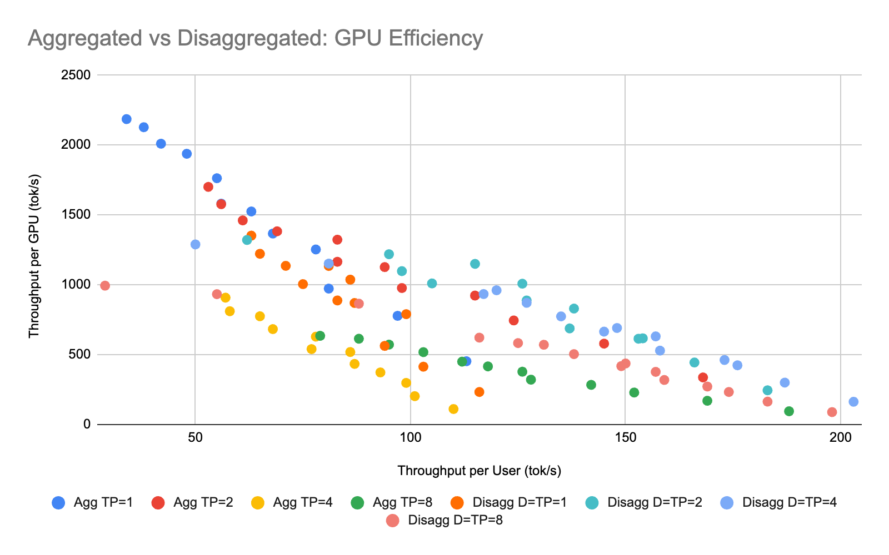
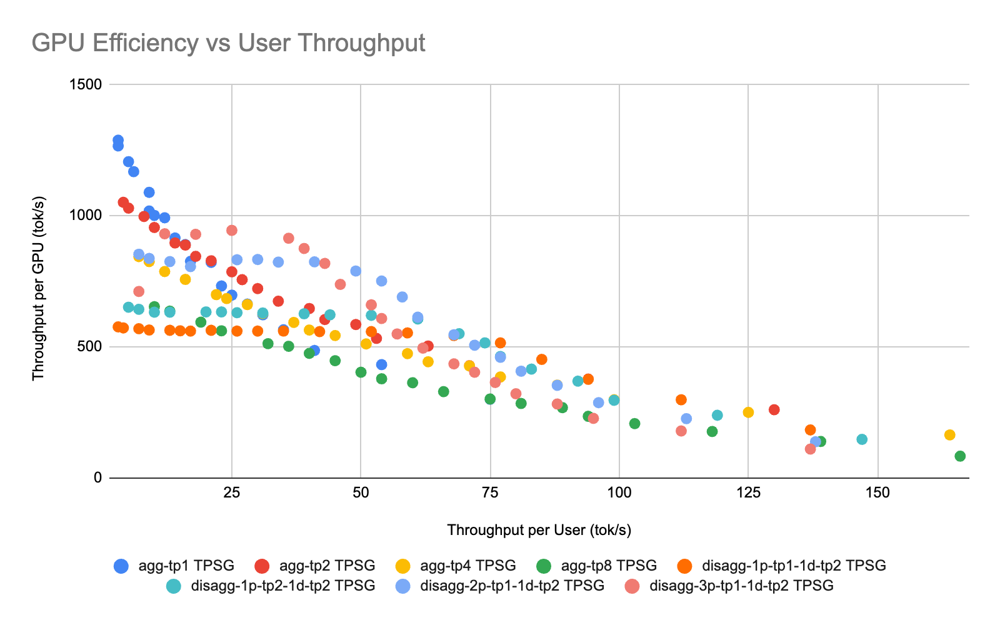
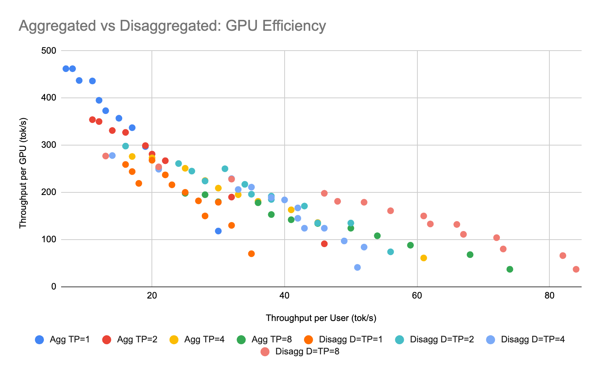
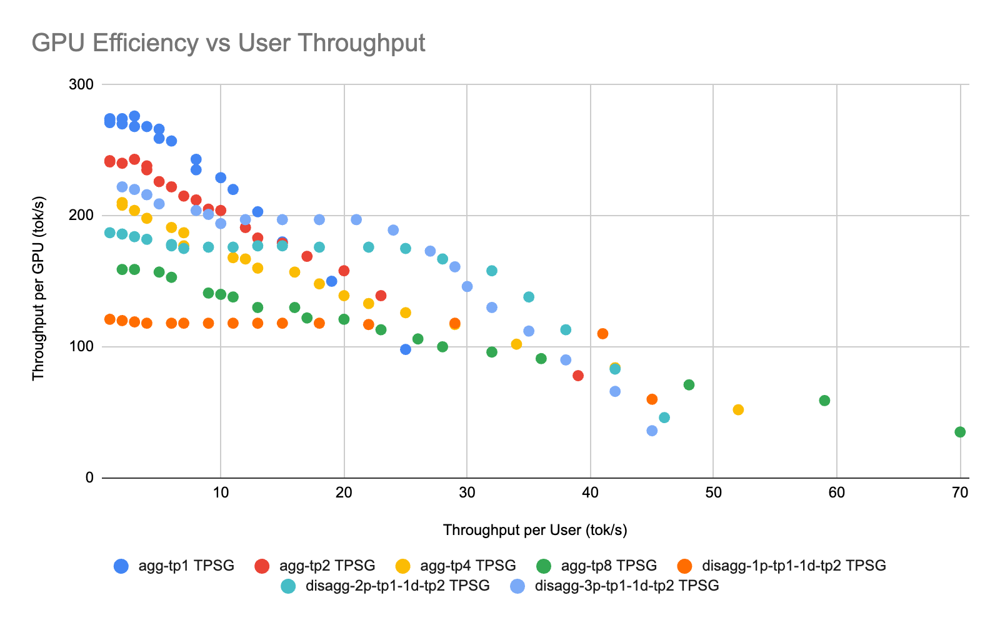

# Appendix

## gpt-oss-120b results

```bash
MODEL="openai/gpt-oss-120b"
IMAGE="ghcr.io/vcave/llm-d/llm-d-rocm:vllm_700_v0151_qk_triton_attn_fix_23c8e6822"
VLLM_ROCM_USE_AITER="1"
VLLM_ROCM_QUICK_REDUCE_QUANTIZATION="INT4"
EXTRA_VLLM_ARGS="--attention-backend ROCM_AITER_UNIFIED_ATTN"
just bench-tp-full
```

From the prefill workload benchmarks, we identify the Prefill throughput:

### Table 1: Prefill Throughput

|     | Tokens / second | Requests / second |
|-----|-----------------|-------------------|
| TP=1 | 37148          | 9.06              |
| TP=2 | 53577          | 13.08             |
| TP=4 | 85522          | 20.87             |
| TP=8 | 101746         | 24.84             |

Below, at each Concurrency level, we estimate the number of Prefill instances required to sustain a Decode instance at TP=2.

### Table 2: gpt-oss-120b Configuration Analysis

| D_Config | D_GPUs | D_Concurrency | Decode Output (tok/s) | Prefill Demand (tok/s) | P_GPUs @TP=1 | P_GPUs @TP=2 | P_GPUs @TP=4 | P_GPUs @TP=8 | Best P_GPUs | Total GPUs | TPSU (tok/s/user) | TPSG (tok/s/GPU) |
|----------|--------|---------------|----------------------|------------------------|--------------|--------------|--------------|--------------|-------------|------------|-------------------|------------------|
| TP=2 | 2 | 4 | 730.9 | 11694.4 | 1 | 2 | 4 | 8 | 1 | 3 | 182.725 | 243.6333333 |
| TP=2 | 2 | 8 | 1329.2 | 21267.2 | 1 | 2 | 4 | 8 | 1 | 3 | 166.15 | 443.0666667 |
| TP=2 | 2 | 12 | 1848.7 | 29579.2 | 1 | 2 | 4 | 8 | 1 | 3 | 154.0583333 | 616.2333333 |
| TP=2 | 2 | 16 | 2451.2 | 39219.2 | 2 | 2 | 4 | 8 | 2 | 4 | 153.2 | 612.8 |
| TP=2 | 2 | 20 | 2746.8 | 43948.8 | 2 | 2 | 4 | 8 | 2 | 4 | 137.34 | 686.7 |
| TP=2 | 2 | 24 | 3314.5 | 53032 | 2 | 2 | 4 | 8 | 2 | 4 | 138.1041667 | 828.625 |
| TP=2 | 2 | 28 | 3548 | 56768 | 2 | 4 | 4 | 8 | 2 | 4 | 126.7142857 | 887 |
| TP=2 | 2 | 32 | 4027.1 | 64433.6 | 2 | 4 | 4 | 8 | 2 | 4 | 125.846875 | 1006.775 |
| TP=2 | 2 | 40 | 4594.4 | 73510.4 | 2 | 4 | 4 | 8 | 2 | 4 | 114.86 | 1148.6 |
| TP=2 | 2 | 48 | 5044.1 | 80705.6 | 3 | 4 | 4 | 8 | 3 | 5 | 105.0854167 | 1008.82 |
| TP=2 | 2 | 56 | 5487.1 | 87793.6 | 3 | 4 | 8 | 8 | 3 | 5 | 97.98392857 | 1097.42 |
| TP=2 | 2 | 64 | 6087.6 | 97401.6 | 3 | 4 | 8 | 8 | 3 | 5 | 95.11875 | 1217.52 |
| TP=2 | 2 | 128 | 7919.3 | 126708.8 | 4 | 6 | 8 | 16 | 4 | 6 | 61.86953125 | 1319.883333 |

### Figures: openai/gpt-oss-120b

**Figure: openai/gpt-oss-120b PD configuration**



**Figure: openai/gpt-oss-120b Pareto sweep**



---

## LLama-3.3-70B results

```bash
MODEL="RedHatAI/Llama-3.3-70B-Instruct-FP8-dynamic"
IMAGE="ghcr.io/vcave/llm-d/llm-d-rocm:vllm_700_qk_triton_aiter_uni_attn_fix_23c8e6822"
EXTRA_VLLM_ARGS="--attention-backend ROCM_AITER_UNIFIED_ATTN"
VLLM_ROCM_USE_AITER="1"
VLLM_ROCM_QUICK_REDUCE_QUANTIZATION="INT4"
just bench-tp-full
```

### Table 3: Prefill Throughput from Prefill workload benchmarks

|     | Throughput (tokens / second) | Requests / second |
|-----|------------------------------|-------------------|
| TP=1 | 6894                        | 1.68              |
| TP=2 | 10721                       | 2.6               |
| TP=4 | 12852                       | 3.13              |
| TP=8 | 27367                       | 6.68              |

### Table 4: Llama-3.3-70B Configuration Analysis

| D_Config | D_GPUs | D_Concurrency | Decode Output (tok/s) | Prefill Demand (tok/s) | P_GPUs @TP=1 | P_GPUs @TP=2 | P_GPUs @TP=4 | P_GPUs @TP=8 | Best P_GPUs | Total GPUs | TPSU (tok/s/user) | TPSG (tok/s/GPU) |
|----------|--------|---------------|----------------------|------------------------|--------------|--------------|--------------|--------------|-------------|------------|-------------------|------------------|
| TP=2 | 2 | 4 | 223.1 | 3569.6 | 1 | 2 | 4 | 8 | 1 | 3 | 55.775 | 74.36666667 |
| TP=2 | 2 | 8 | 404 | 6464 | 1 | 2 | 4 | 8 | 1 | 3 | 50.5 | 134.6666667 |
| TP=2 | 2 | 12 | 540.3 | 8644.8 | 2 | 2 | 4 | 8 | 2 | 4 | 45.025 | 135.075 |
| TP=2 | 2 | 16 | 685.5 | 10968 | 2 | 4 | 4 | 8 | 2 | 4 | 42.84375 | 171.375 |
| TP=2 | 2 | 20 | 769.7 | 12315.2 | 2 | 4 | 4 | 8 | 2 | 4 | 38.485 | 192.425 |
| TP=2 | 2 | 24 | 923.1 | 14769.6 | 3 | 4 | 8 | 8 | 3 | 5 | 38.4625 | 184.62 |
| TP=2 | 2 | 28 | 978.7 | 15659.2 | 3 | 4 | 8 | 8 | 3 | 5 | 34.95357143 | 195.74 |
| TP=2 | 2 | 32 | 1086.3 | 17380.8 | 3 | 4 | 8 | 8 | 3 | 5 | 33.946875 | 217.26 |
| TP=2 | 2 | 40 | 1251.2 | 20019.2 | 3 | 4 | 8 | 8 | 3 | 5 | 31.28 | 250.24 |
| TP=2 | 2 | 48 | 1344.1 | 21505.6 | 4 | 6 | 8 | 8 | 4 | 6 | 28.00208333 | 224.0166667 |
| TP=2 | 2 | 56 | 1469.6 | 23513.6 | 4 | 6 | 8 | 8 | 4 | 6 | 26.24285714 | 244.9333333 |
| TP=2 | 2 | 64 | 1563.2 | 25011.2 | 4 | 6 | 8 | 8 | 4 | 6 | 24.425 | 260.5333333 |
| TP=2 | 2 | 128 | 2088.2 | 33411.2 | 5 | 8 | 12 | 16 | 5 | 7 | 16.3140625 | 298.3142857 |

### Figures: RedHatAI/Llama-3.3-70B-Instruct-FP8-dynamic

**Figure: RedHatAI/Llama-3.3-70B-Instruct-FP8-dynamic PD configuration**



**Figure: RedHatAI/Llama-3.3-70B-Instruct-FP8-dynamic Pareto sweep**



---

## Raw Data

The complete raw data and detailed results for all experiments are available in the following datasets:
### Llama-3.3-70B-Instruct-FP8-dynamic

- [P/D Config Sweep](https://docs.google.com/spreadsheets/d/1nsKGE52N1HPerTpqI-5qSBfU5WuYCR8YbIwjHTuet2c)
- [Pareto Chart](https://docs.google.com/spreadsheets/d/1SdvzxxK2diSpx5wZWo8fh1VnKqC2plg9n8xEHJL7QQk/edit?gid=556326636#gid=556326636)

### gpt-oss-120b

- [P/D Config Sweep](https://docs.google.com/spreadsheets/d/1m3oJjMYlSmSq8FYw5ky6YXD9eF-eBHX8mPEka6GH7Ak)
- [Pareto Chart](https://docs.google.com/spreadsheets/d/1f-L8xFmYbmpEnhENckhCHEncX4PGknNvKcLuWE77AHY)
- [Multi-node Scale-out](https://docs.google.com/spreadsheets/d/1ffLoMJ8i2LthtK2cDB9lCiK5pkCAHM2Zzq76cg6bfAM)

